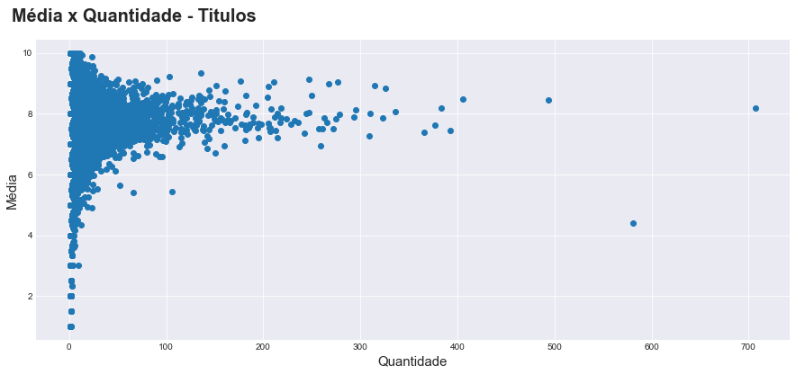
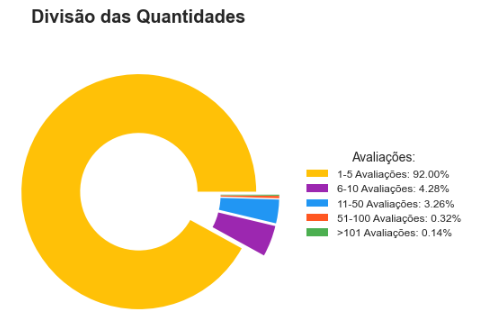

# Sistema de Recomendação - Livros
Este repositório contém script de um sistema de recomendações de leitura para cada cliente

 

# _Objetivo do projeto_

Criar um modelo de recomendação personalizada de livros para fornecer sugestões precisas e relevantes aos usuários.

 

# _1. Problema de Negócio_

A necessidade de oferecer recomendações de leitura mais precisas e relevantes para cada cliente, considerando o crescimento do mercado de livros e a diversificação do público leitor.

Fonte: Esse notebook teve com base notebook publicado no freecodecamp

 

# _2. Justificativa_

- **Por quê:** Com o aumento do mercado de livros e a diversificação dos gostos dos leitores, torna-se desafiador fornecer recomendações de leitura que sejam adequadas e relevantes para cada usuário. Um modelo de recomendação personalizada pode aumentar a satisfação dos usuários, impulsionar as vendas e fidelizar os clientes, oferecendo sugestões que estejam alinhadas com suas preferências individuais.
- **Como:** Utilizando algoritmos de aprendizado de máquina e técnicas de recomendação, será possível analisar o comportamento e as preferências de cada usuário com base em seu histórico de compras e interações com os livros. O modelo de recomendação personalizada irá considerar essas informações para fazer sugestões de livros que sejam altamente relevantes e interessantes para cada usuário.
- **O quê:** A solução consistirá na criação de um modelo de recomendação personalizada de livros, que irá analisar o histórico de compras e preferências de cada usuário para oferecer sugestões personalizadas.

 

# _3. Premissas_

O conjunto de dados de amostra resume o comportamento de 3.150 clientes da Amazon.

As variáveis originais do conjuto de dados são: 

Variável | Definição
------------ | -------------
ISBN | Código|
Book-Title | Nome do livro|
Book-Author | Autor do livro|
Year-Of-Publication | O ano que ele foi publicado|
Publisher | Editora|
Image-URL-S | URL|
Image-URL-M | URL|
Image-URL-L | URL|

 

# _4. Planejamento da Solução_

1. **ENTENDIMENTO DO NEGÓCIO**

Definição do problema: É importante definir claramente qual é o problema a ser resolvido ou a pergunta a ser respondida. É preciso entender o objetivo do projeto e a relevância do problema.

    - Descrição do negócio
    - Planejamento da solução

2. **IMPORTANDO AS BIBLIOTECAS**

Importação de bibliotecas: Nesta etapa, as bibliotecas necessárias para o desenvolvimento do modelo de machine learning são importadas. Isso inclui bibliotecas para manipulação de dados, visualização, modelagem e avaliação.

3. **COLETA DOS DADOS**

Coleta de dados: Nesta etapa, os dados são coletados a partir de diversas fontes, como bases de dados, APIs, arquivos de texto, imagens, etc.

4. **ANÁLISE EXPLORATÓRIA DOS DADOS**

Análise exploratória de dados: Nesta etapa, os dados são analisados para identificar possíveis padrões, tendências, correlações e informações relevantes que possam auxiliar na construção do modelo de machine learning. É importante entender os dados coletados, avaliar a qualidade dos dados e identificar quaisquer problemas ou limitações.

    - **Passo 1:** Análise Descritiva dos Dados
        - Esta etapa consiste na descrição estatística dos dados coletados, como média, mediana, desvio padrão, entre outros.
    - **Passo 2:** Exploração de Dados
        - Nesta etapa, os dados são visualizados e analisados graficamente para identificar padrões e relações entre as variáveis.    

5. **PRÉ-PROCESSAMENTO**

Preparação de dados ou Pré-processamento de dados: Nesta etapa, os dados são limpos, transformados e preparados para serem utilizados no modelo de machine learning. Isto inclui tarefas como normalização, codificação, preenchimento de valores ausentes, remoção de outliers, etc.

6. **TREINAMENTO ALGORITMOS DE MACHINE LEARNING**

Modelagem ou Seleção do modelo: Nesta etapa, um modelo de machine learning é escolhido com base na tarefa a ser realizada e nos dados disponíveis.

7. **IMPLEMENTAR O MODELO PARA A PRODUÇÃO**

Implantação: Nesta etapa, o modelo é implantado em um ambiente de produção para utilização em situações reais para resolver o problema.

 

# _5. Insights_

*Resumo dos insights durante análise exploratória de dados (EDA):*

- Até 75% da base tem até duas avaliações.

- Aparentemente não existe essa correlação entre quanto mais vende, maior a média.

**Gráfico para analisar a Média x Quantidade - Titulos.**

 

**Nota:**
- Não tem uma correlação, ou seja, quanto maior a quantidade de livros, melhor é a média, mas não temos essa correlação, porque temos uma dispersão.
- Existe uma concentração dos livros com poucas avaliações falando em quantidade, mas quando fala de avaliação eles tem uma concentração muito forte.

**Gráfico da nuvem das palavras negativas.**

 

**Nota:**
- Talvez produtos com poucas avaliações eles não estão maduros na visão do cliente, para que possamos recomendar eles.

 

# _6. Modelos de Machine Learning_

Ao utilizar algoritmos de aprendizado de máquina, podemos criar sistemas que oferecem sugestões personalizadas para os usuários, ajudando-os a descobrir novos produtos e aumentando o engajamento do cliente.

Neste projeto, vamos explorar uma técnica comum em sistemas de recomendação.

NearestNeighbors é um algoritmo não supervisionado, onde ele vai aprender usando a distância, ou seja, ele vai calcular a distância para fazer o aprendizado desse modelo.

 

# _7. Performance do Modelo de Machine Learning_

Com base no histórico de leitura de um usuário, podemos selecionar os livros que mais se assemelham. Veja na figura abaixo as recomendações.

 

 

# _8. Conclusão_

Neste projeto, buscamos solucionar o desafio de oferecer recomendações de leitura precisas e relevantes para os usuários, considerando o crescimento do mercado de livros e a diversificação do público leitor. Através da implementação de um modelo de recomendação personalizada de livros, foi possível criar uma solução que proporciona sugestões personalizadas aos usuários, aumentando sua satisfação e o engajamento com a marca.

Utilizando algoritmos de aprendizado de máquina e técnicas de recomendação, o modelo foi capaz de fazer sugestões de livros altamente relevantes para cada usuário, levando em consideração suas preferências e gostos individuais.

 

# _9. Próximos passos_

Incluir recursos adicionais, como avaliações e críticas de livros, bem como recursos de busca e navegação no catálogo de livros da empresa.
